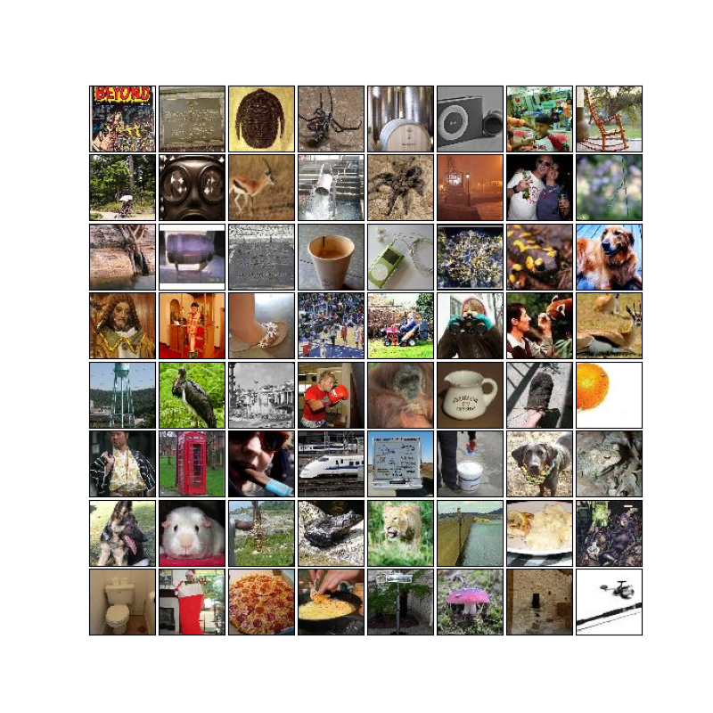
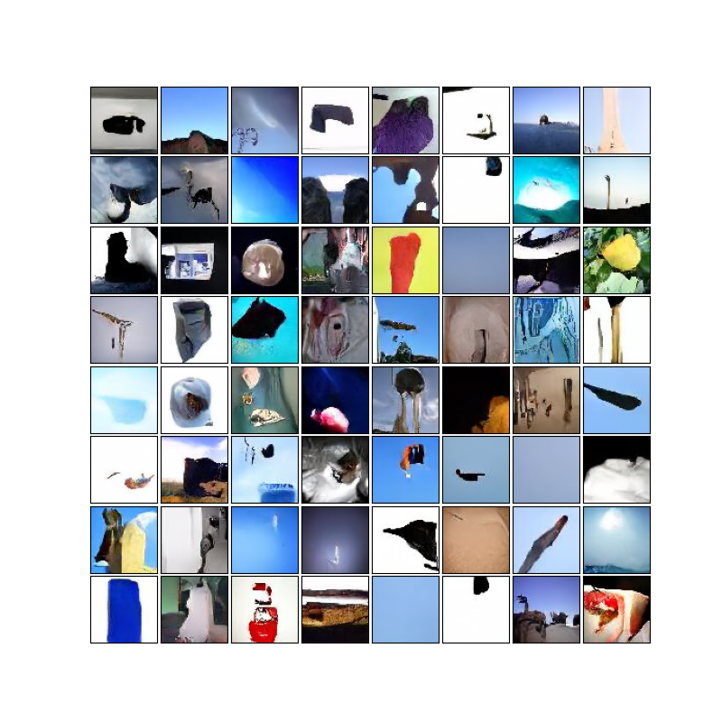

# A Deep Dive into Diffusion-Based Image Generation Model

<!---
## Installation

```bash
$ git clone https://github.com/Samartha27/mini_ddmp.git
$ cd mini_ddmp
$ conda env create -f environment.yml
$ conda activate env
```
--->

Authors: Yu Xin, Samartha Ramkumar

The youtube link to our presentation is found here. [https://youtu.be/0Mv9eMjMYIQ](https://youtu.be/0Mv9eMjMYIQ)

## Abstract

<!-- In the Denoising Diffusion Probabilistic model for image generation,  -->

In this project, we explored the internal of the [Denoise Diffusion Probablistic Model (DDPM)][DDPM_paper], a diffusion-based image generation model. We attempted to implement this model using pytorch. Finally,
we trained the model on [TinyImageNet][TinyImageNet] and the results are evaluated using [FID].

## Motivation and Related Works

Deep Learning based image generation techniques has been under active reserarch, as it is useful in many situations ranging from assisting artists to develop creative ideas to generating photorealistic human faces from texual descriptions for law enforcements. 
The techniques for Deep Learning based image generation comes from primarily 4 flavors, [Generative Adversarial Network (GAN)][gan_paper], [Variational Autoencoder (VAE)][vae_paper], [Flow-base methods][flow_paper], and Diffusion-based methods.


*4 major approaches of image generation, [source][diffusion-blog]*

Comparing to other approaches, diffusion-based methods are powerful because it balanced tractability (i.e., how interpretable is the model) and flexibility (i.e., how expressive is the model), which has been a major difficulty for other approaches ([cite][diffusion-blog]).
Diffusion-based methods is also developed quite recently, making it one of the most activly researched area in computer vision and deep learning.

To the best of our knowledge, [Denoise Diffusion Probablistic Model][DDPM_paper] (abbrivated as DDPM) is the first approach to use diffusion method on image generation task. It proposed a Markov Chain model for the distrbution of images of different noise level. It uses an analytical process to add noise to image and a neural network to remove the noise from the distrbution. After training, new images can be generated by applying the denoising neural network starting from a random noise. Later, this model has been improved in many ways, from speeding up the sampling process ([DDIM][DDIM_paper]) to improving the quality of generation ([Improved Diffusion][improved-DDPM_paper]). Recently, researchers also found ways to incorporate thematically useful information (such as text in English) into the diffusion generation process to control the image it generates ([DALLE][DALLE_paper], [GLIDE][GLIDE_paper], [IMAGEN][IMAGEN_paper], [Stable Diffusion][stable-diffusion_paper]). Despite these impressive improvements in the recent research, the diffusion process is largely unchanged. Therefore, we will explore the original DDPM to gain some insight on diffusion-based models. 


## Methodology

### Overview

DDPM generates images by starting with a random noise and iteratively reducing the noise by applying a denoising neural network. More specifically, it defines a Markov Chain with denoising process (via neural network with parameter $\theta$) $p_\theta(x_{t-1} | x_t)$ and noise-adding process $q_(x_{t} | x_{t-1})$.

<!--  -->
<p align = "center">

</p>

*Illustration from the [DDPM paper][DDPM_paper]*

The noisy image is assumed to be drawn from a distribution $x_T$ and the training image $x_0$.

In a nutshell, we try to slowly and systematically corrupt the inherent structure in a data distribution with an iterative forward diffusion process by making use of noise sampling. This is followed by the use of an neural network ([UNet][unet_paper] in this case) which learns to restore the lost structure in the data distribution during the reverse diffusion process. This yields us a tractable generative model of the data.

We start with the original image and iteratively add noise in each step. We use a Normal distribution to sample the noise. After sufficient iterations, we can say that the final image follows an isotropoic gaussian distribution. We do not employ the same noise at each timestep during the forward process. This can be regulated with the help of a scheduler which scales the mean and variance in order to avoid variance explosion as the noise is increases. The reverse diffusion process involves the neural network trying to learn how to remove noise step by step. This way after the model has completed trying, when we feed the model pure noise sampled from the Normal Distribution, it gradually removes the noise in specified timesteps for tractable outcome and produces the output image with clarity. 

<!-- The model produces 3 predictions:

1. Mean of the noise at each time step. (Variance is kept fixed in this implementation)
2. Predicting the original image directly (Not practical)
3. The noise of image directly -->

### Diffusion Process

#### Forward Process $q$

The forward process is the noise adding process. It has no learnable parameters in this implementation. We defined $\beta_1, ..., \beta_T$ to be the variance of each step. This is generated by a predefined variance schedule.

$$
\begin{align*}
q(x_t|x_{t-1}) &= \mathcal{N} \Big(x_t; \sqrt{1-\beta_t} x_0, \beta_t \mathbf{I} \Big)
\end{align*}$$

Using a [reparameterization trick][diffusion-blog], we sample at any timestep $t$.

$$
\begin{align*}
q(x_t|x_0) &= \mathcal{N} \Big(x_t; \sqrt{\bar\alpha_t} x_0, (1-\bar\alpha_t) \mathbf{I} \Big)
\end{align*}$$

where  $$\alpha_t = 1 - \beta_t ,   \bar\alpha_t = \prod_{s = 1}^{t} \alpha_s$$

#### Reverse Process $p$
The reverse process removes noise starting at $p(x_T) = \mathcal{N}(x_T; \mathbf{0}, \mathbf{I})$
for $T$ time steps.

$$
\begin{align}
p_\theta(x_{t-1} | x_t) &= \mathcal{N}\big(x_{t-1};
\mu_\theta(x_t, t), \Sigma_\theta(x_t, t)\big) \\
p_\theta(x_{0:T}) &=p_\theta(x_T) \prod_{t = 1}^{T} p_\theta(x_{t-1} | x_t) \\
\end{align}$$

where, $\theta$ are the learnable parameters. In this implementation, $\Sigma\theta$ is not learnable and assumed to be $\beta$ according to the variance schedule. This is later improved in the [Improved Diffusion][improved-DDPM_paper].

Using some math tricks, we can ask the neural network to predict the nose instead of the image. Given noise predictor $\epsilon_\theta(x_t, t)$, we can compute the predicted mean $\mu_\theta(x_t, t)$.

$$
\begin{align}
\mu_\theta(x_t, t) &= \tilde\mu \bigg(x_t,
  \frac{1}{\sqrt{\bar\alpha_t}} \Big(x_t -
   \sqrt{1-\bar\alpha_t} \epsilon_\theta(x_t, t) \Big) \bigg) \\
  &= \frac{1}{\sqrt{\alpha_t}} \Big(x_t -
  \frac{\beta_t}{\sqrt{1-\bar\alpha_t}} \epsilon_\theta(x_t, t) \Big)
\end{align}$$


#### U-net Architecture
An U-net architecture was choosen as the noise predictor $\epsilon_\theta(x_t, t)$. The network takes the input image and projects the image into smaller resolution bottleneck with the help of a Resnet block and Downsample block. After the bottleneck it projects the module back into the original size with the help of Upsample blocks. There are attention blocks employed at certain resolutions along with skip connections between layers of the same spatial resolutions. The sinusoidal embeddings projected into each of the residual blocks informs the model of which timestep it is running and also helps the model during the Reverse-diffusion / Denoising process to remove appropriate amounts of noise corresponding to how much noise was added in the forward diffusion at each time step.

<!--  -->
<p align = "center">

</p>

*Original [Unet][unet_paper] Architecture. DDPM made modifications in each block, but retains the same high level architecture*

#### Variance Schedule

The variance $\beta_1, ..., \beta_t$ is increasing linearly from $10^{-4}$ to $0.02$ in the original implementation. However, other schedules are also possible and may produce better results. For example, the [Improved DDPM paper][improved-DDPM_paper] proposed cosine schedule.

#### Training and Inference

With all the above, the training and sampling algorithms can be defined as the following

<!--  -->

*Training and Inference Algorithms suggested by the [DDPM paper][DDPM_paper]*

In the training, we first uniformly sample a random timestep $t$. Then using the forward_process, we add the noise to image according to $t$, feeding the noisy image to the neural network, and use a loss function to compare the predicted noise and actual noise. The loss function can be L1-norm, L2-norm (MSE), or smooth-L1. In reality, the loss function of diffusion model is computed using Varitional Lower Bound (VLB) (see [VAE paper][vae_paper] for detail). With some simplification, we can derive the loss function mentioned above.

During sampling, we follow the reverse process and apply the denoise neural network $T$ times to get the final image. Unlike the forward process, we have to run the neural network $T$ times, which can be quite expensive. This is the major issue of DDPM, and many later research has improved upon this.

## Experiments

### Dataset

For training we used the [TinyImageNet][TinyImageNet] ([Download][TinyImageNet_dl]) dataset. This dataset consists of 100,000 images with 200 classes of objects (500 image for each class). Each image is has 3 channels (RGB) and has a width and height of 64. They can be represented as a tensor with dimension `(3, 64, 64)` in `CHW` notation.

<!--  -->

*Samples from [TinyImageNet][TinyImageNet] dataset*

<!-- The images are normalized using mean as ```[0.485, 0.456, 0.406]``` and standard deviation as ```[0.229, 0.224, 0.225]```  -->

### Experiment Detail

Due to limited time, we are unable to get our implementation from scratch to work. The below evaluations are partially based on [this DDPM implementation][diffusion-impl].

We trained the u-net with 4 layers (on each side of the "U") using L1 loss and batch size 64 with Adam optimizer with learning rate of 0.0002. We used a diffusion timestep of $T = 1000$ that is the same as the DDPM paper. We used the cosine variance scheduler mentioned in the [Improved DDPM][improved-DDPM_paper]. The training takes around 10 minutes per epoch on NVIDIA V100S GPU. We trained for 100 epoch for the final model. The evaluation takes around 90 second to generate a batch of 64 images.

## Evaluation and Results

We computed the [FID][FID] using the generated images against the training data as part of how our model performs for the purpose of evaluation. Here is what we found.

| Condition  | FID score  |
|---|---|
| Random noise      | 410.870 |
| Epoch 20          | 117.015 |
| Epoch 50          | 195.967 |
| Epoch 100         | 139.16  |


The figure below shows how the loss function plateaus after the approximately 500 iterations. With a batch size of 64, each epoch is around 1563 iterations. The loss function eventually stablizes at around 0.12 to 0.18.


The FID suggests that the model is quite unstable, the quality of the generated results varies noticeably between epochs. We suspect this is due to the high dependence on the initial noise for generation. Recent research has provided insight to solve this issue by putting thematically meaningful information into the diffusion process (also known as conditioned diffusion) to contrain the generation results.

## Examples

Here is generated images at different Epoch (generated images in each group is independent)

*Epoch 1*            |  *Epoch 20*
:-------------------------:|:-------------------------:
  |  

*Epoch 50* | *Epoch 100*
:-------------------------:|:-------------------------:
 | 


Here is an animation of the reverse process that generates an image


## References

[Diffusion Models](https://medium.com/@monadsblog/diffusion-models-4dbe58489a2f)

[DDPM paper][DDPM_paper]

[Annotated Diffusion][annotated-diffusion]
<!-- [EINOPS](https://github.com/arogozhnikov/einops) -->


[TinyImageNet]: https://www.kaggle.com/competitions/tiny-imagenet/overview
[TinyImageNet_dl]: http://cs231n.stanford.edu/tiny-imagenet-200.zip
[FID]: https://en.wikipedia.org/wiki/Fréchet_inception_distance
[DDPM_paper]: https://arxiv.org/abs/2006.11239
[image-generation-approaches]: https://lilianweng.github.io/posts/2021-07-11-diffusion-models/generative-overview.png
[diffusion-blog]: https://lilianweng.github.io/posts/2021-07-11-diffusion-models/
[annotated-diffusion]: https://huggingface.co/blog/annotated-diffusion
[vae_paper]: https://arxiv.org/abs/1312.6114
[gan_paper]: https://arxiv.org/abs/1406.2661
[flow_paper]: https://arxiv.org/abs/1505.05770
[improved-DDPM_paper]: https://arxiv.org/abs/2102.09672
[DDIM_paper]: https://arxiv.org/abs/2010.02502
[GLIDE_paper]: https://arxiv.org/abs/2112.10741
[DALLE_paper]: https://arxiv.org/abs/2102.12092
[IMAGEN_paper]: https://arxiv.org/abs/2205.11487
[stable-diffusion_paper]: https://arxiv.org/abs/2112.10752
[unet_paper]: https://arxiv.org/abs/1505.04597
[diffusion-impl]: https://github.com/lucidrains/denoising-diffusion-pytorch
